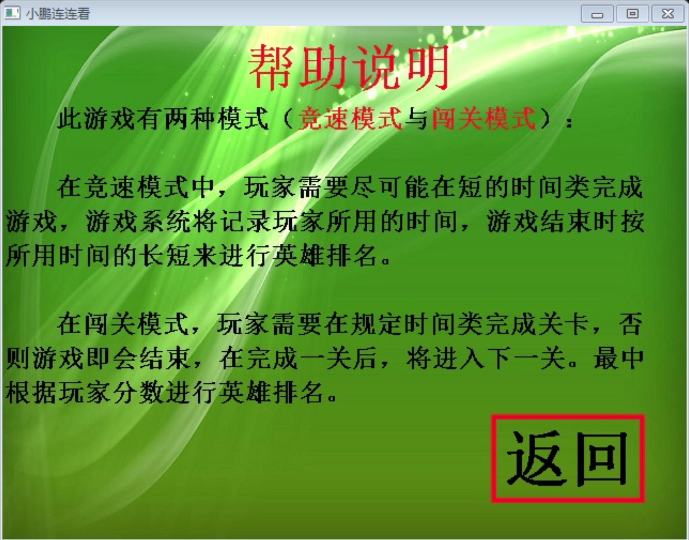
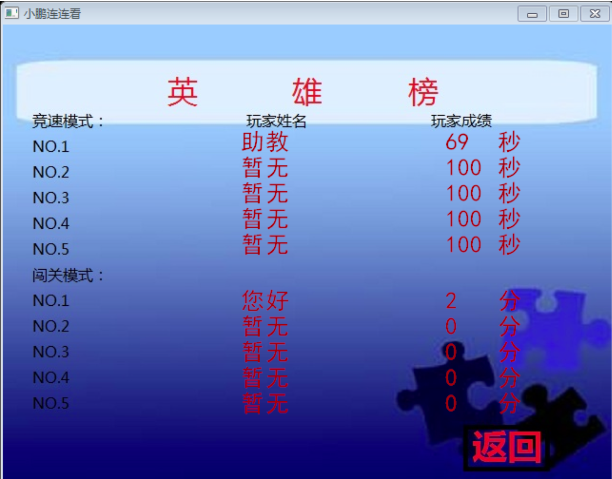
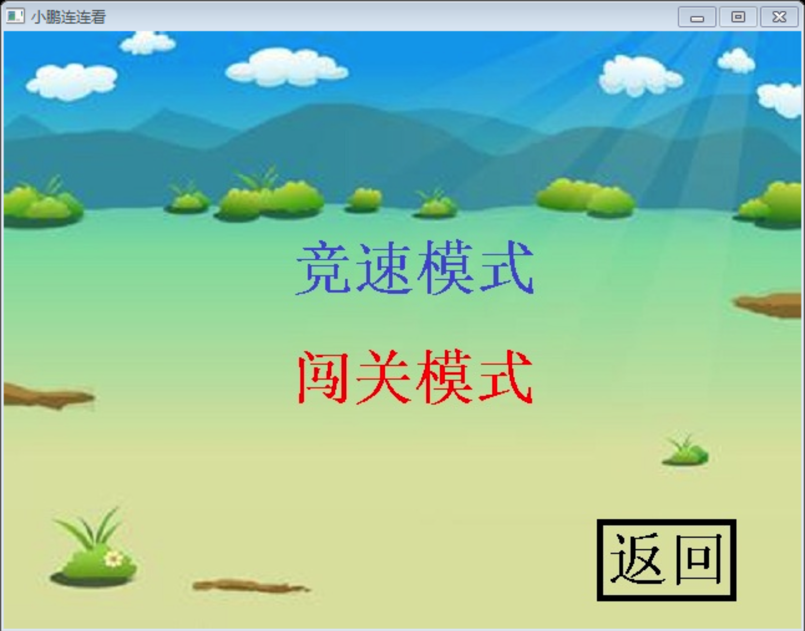
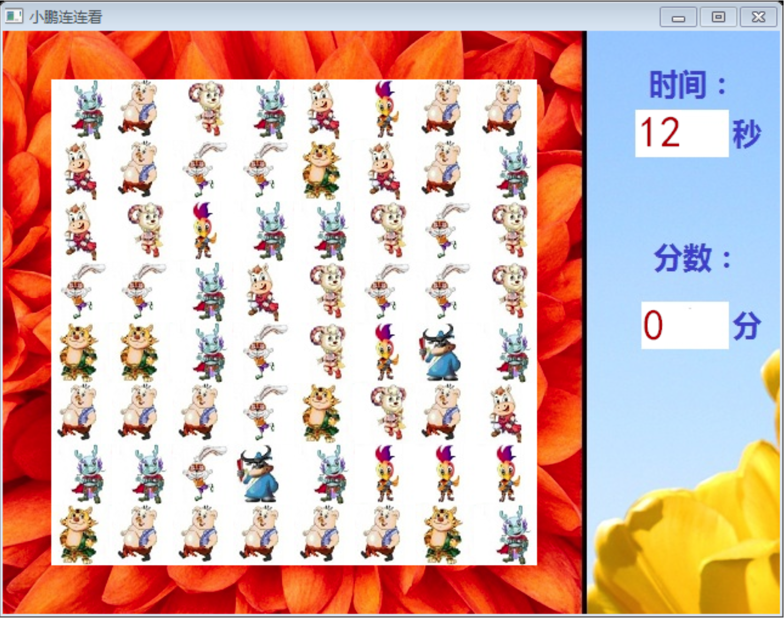
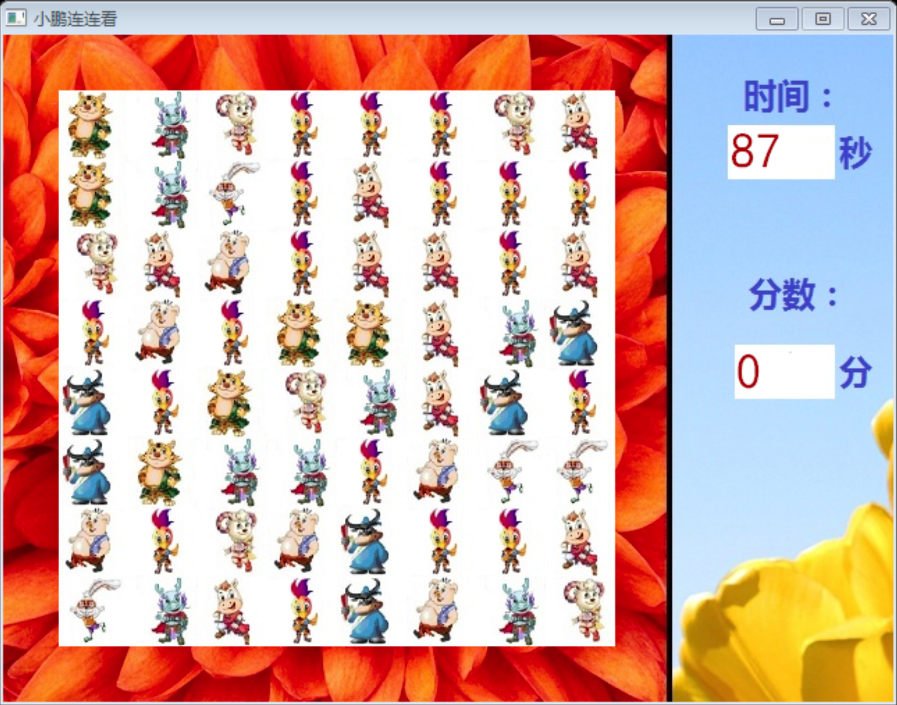

# 连连看
本程序基于windows系统，采用Visual Studio进行开发。源代码见小鹏连连看.cpp.

#### 用法
在windows下打开release文件下的鹏连连看.exe文件。会有以下弹窗:

点击帮助：

点击英雄榜：

点击开始游戏，此时会出现两个选项：

在不同游戏模式下，游戏玩法不同：

在竞速模式下，时间从0开始计时，玩家需要在最短时间类完成游戏：

在闯关模式下，每关有90秒的时间，在90秒内完成游戏可以进入下一关，否则游戏即会结束：

祝玩得愉快！
